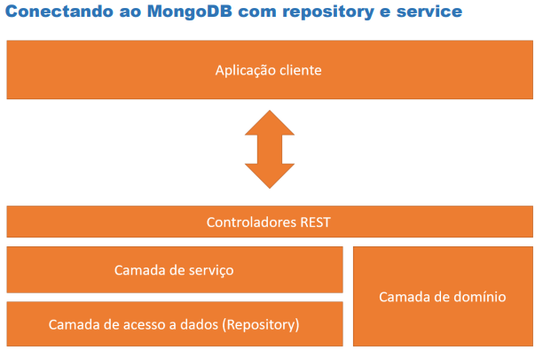
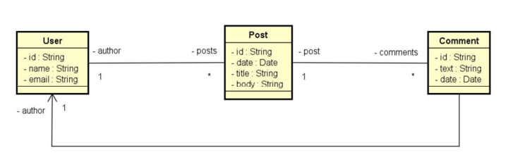
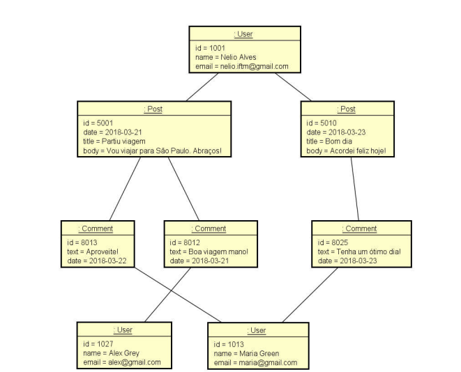
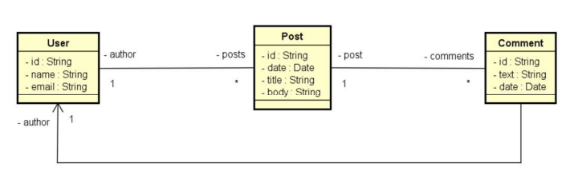
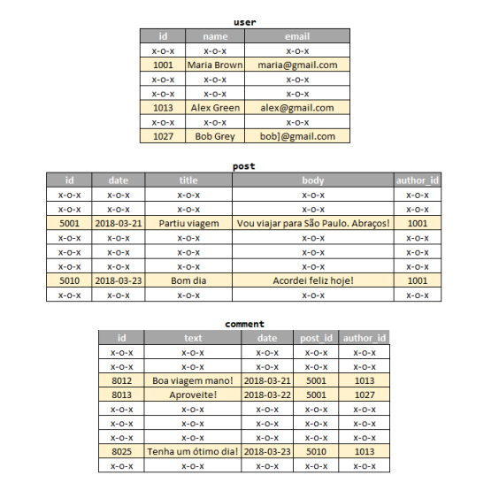

# 📘 Workshop MongoDB com Spring Boot

Projeto desenvolvido para estudo de **banco de dados orientado a documentos (NoSQL)** utilizando **Spring Boot** e **MongoDB**.

Este repositório foi construído a partir do curso do [Nelio Alves](http://educandoweb.com.br), com adaptações e evoluções pessoais. O objetivo é compreender os principais conceitos de bancos de dados NoSQL, implementar operações CRUD, explorar associações entre documentos e realizar consultas utilizando **Spring Data MongoDB**.

---

<p align="center">
  
</p>

## 🚀 Tecnologias utilizadas

* **Java 17+**
* **Spring Boot 3.x**
* **Spring Data MongoDB**
* **MongoDB Community Server**
* **Maven**

---

## 🎯 Objetivos do projeto

* Compreender diferenças entre **modelo relacional** e **modelo orientado a documentos**.
* Implementar operações **CRUD** em MongoDB com Spring Boot.
* Trabalhar com **associações entre documentos** (objetos aninhados e referências).
* Criar **consultas personalizadas** com query methods e anotações `@Query`.
* Desenvolver API REST com recursos de usuários e posts.

---

## 📂 Estrutura do projeto

* **domain** → entidades do sistema (`User`, `Post`, etc.)
* **repository** → interfaces que estendem `MongoRepository`
* **services** → camada de regras de negócio
* **resources** → controladores REST (endpoints)
* **dto** → objetos de transferência de dados
* **config** → classe `Instantiation` para carga inicial do banco

---

## ⚡ Exemplos de funcionalidades

* Listagem de usuários e posts.
* Busca de usuário por ID.
* Inserção, atualização e exclusão de usuários.
* Criação de posts com comentários aninhados.
* Consultas de posts por:

  * Título
  * Intervalo de datas
  * Texto no corpo ou comentários

<p align="center">
  
</p>
<p align="center">
  
</p>
<p align="center">
  
</p>
<p align="center">
  
</p>

---

## 🛠️ Como rodar o projeto

### 1. Clonar o repositório

```bash
git clone https://github.com/SEU-USUARIO/workshop-spring-boot-mongodb.git
cd workshop-spring-boot-mongodb
```

### 2. Subir o MongoDB

Crie as pastas de dados (se ainda não existirem):

```powershell
mkdir C:\data\db
mkdir C:\data\log
```

Inicie o servidor:

```powershell
mongod --dbpath C:\data\db
```

### 3. Rodar a aplicação

```bash
./mvnw spring-boot:run
```

A aplicação estará disponível em:
👉 [http://localhost:8080](http://localhost:8080)

---

## 🌐 Endpoints principais

* **GET /users** → lista todos os usuários
* **GET /users/{id}** → busca usuário por ID
* **POST /users** → insere novo usuário
* **DELETE /users/{id}** → deleta usuário
* **PUT /users/{id}** → atualiza usuário
* **GET /users/{id}/posts** → retorna posts de um usuário
* **GET /posts/{id}** → busca post por ID
* **GET /posts/titlesearch?text=palavra** → busca posts por título
* **GET /posts/fullsearch?text=palavra\&minDate=YYYY-MM-DD\&maxDate=YYYY-MM-DD** → busca posts com múltiplos critérios

---

## 📖 Referências

* Curso [Java com Spring Boot e MongoDB](https://www.udemy.com/course/mongodb-com-spring-boot/) – Nelio Alves.
* [Documentação oficial Spring Data MongoDB](https://docs.spring.io/spring-data/mongodb/docs/current/reference/html/).
* [MongoDB Docs](https://www.mongodb.com/docs/).

---
